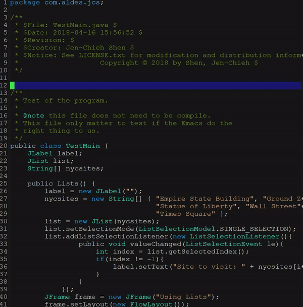
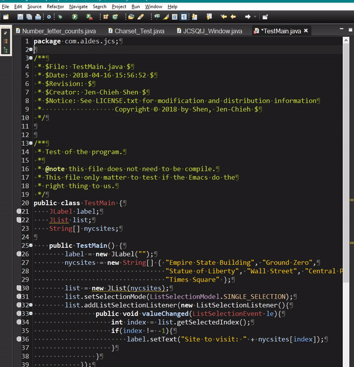

[](https://travis-ci.com/jcs090218/organize-imports-java)
[](https://melpa.org/#/organize-imports-java)
[](https://stable.melpa.org/#/organize-imports-java)
[](https://www.gnu.org/licenses/gpl-3.0)


# organize-imports-java
> Automatically organize imports in Java code.

| Emacs using this package                                | Eclipse built-in                                        |
|:-------------------------------------------------------:|:-------------------------------------------------------:|
|||

Organize Imports Java is an Emacs plugin that helps add required imports 
and removes unused imports from `.java` file. The idea came from amazing 
IDE Eclipse's C-S-o key.

*P.S. Inspired by [Eclipse](https://www.eclipse.org/) organize imports preset behavior.*


## How to use?
1. Create an `oij.config` file at the version control root directory.
An example can be found below in the “Config Example” section.
2. After you have included all the Java Libraries into the `oij.config`
file. You can run `organize-imports-java-do-imports` and it will load
the included jar path in the `oij.config` file and import in the current
buffer (It will take a while loading all the jar/lib files the first
time to create the cache file). If you wish to refresh the
paths-config.oij file then just call `organize-imports-java-reload-paths`
function, and it will do the work.


## Config Example
This is an example of `oij.config` file. It Includes all the java
library paths. This plugin can search for all the paths inside
this jars files you include in this file.
```ini
#
# Include Java .jar file paths.
#

# Use JavaSE-1.7 Environment.
rt=::SDK_PATH::/jre/lib/rt.jar

# External Libraries
JCSQtJ-1.0.2=./test_lib/JCSQtJ-1.0.2.jar
qtjambi-4.8.7=./test_lib/qtjambi-4.8.7.jar

```


## Configuration
Setup Java JDK.
```el
(setq organize-imports-java-java-sdk-path "/path/to/java/jdk/")
```

Include all your library path in the file. Should place
this file at the root of version control directory.
```el
(setq organize-imports-java-lib-inc-file "oij.config")
```

After reading all the library path, this file will be generated
for cache search on what library should be import to current
buffer/file.
```el
(setq organize-imports-java-path-jar-lib-cache-file "paths-cache.oij")
```

Local source will be loaded automatically after loaded all the external .jar files.
The local source file will depends on `organize-imports-java-source-dir-name`
variable path.
```el
(setq organize-imports-java-path-local-source-cache-file "paths-cache-local.oij")
```

This plugin detect each word's font face in the current buffer to find
which word is the class keyword to import. By setting this variable
can add/remove the list of font face you want this plugin to detect
the class type.
```el
(setq organize-imports-java-font-lock-type-face '("font-lock-type-face"))
```

For some reason your project source files isn't under `src` folder. You can
change it by setting this variable.
```el
(setq organize-imports-java-source-dir-name "src")
```

If there are something that you do not usually want to import to your buffer,
you can modified this variable and reload the cache files.
```el
(setq organize-imports-java-non-class-list '("Callable"
                                             "Runnable"))
```


## Key Bindings
If you want, you can just bind the key to the function directly.
```el
;; Do the import, if could not find paths-config.oij file then it will
;; reload the paths once.
(define-key java-mode-map (kbd "C-S-o") #'organize-imports-java-do-imports)
```

## Functions

Reload both local source and jar/lib Java path once. This will overwrite
all the cache file and this call might take a while to complete.
```el
M-x organize-imports-java-reload-paths
```

Just reload the jar/lib Java path once. This should take a while because Java
API is HUGE!
```el
M-x organize-imports-java-reload-jar-lib-paths
```

Just reload the local source Java path once. The time consume should just
depends on how large is your current project.
```el
M-x organize-imports-java-reload-local-source-paths
```

## Tips
* You can just delete either `organize-imports-java-path-jar-lib-cache-file`
or `organize-imports-java-path-local-source-cache-file` cache file in order
to refresh the cache, the cache file will be regenerated as long as you call any
reload paths function or do import function.
* You might want to reload local source cache every time you create a new
.java file in your local source directory.


## Some Possible Improvement
* Performance is terrible when loading all the jar files to path.
Hopefully I can find out a way to get around this issue.


## Contribution
If you would like to contribute to this project, you may either 
clone and make pull requests to this repository. Or you can 
clone the project and establish your own branch of this tool. 
Any methods are welcome!
